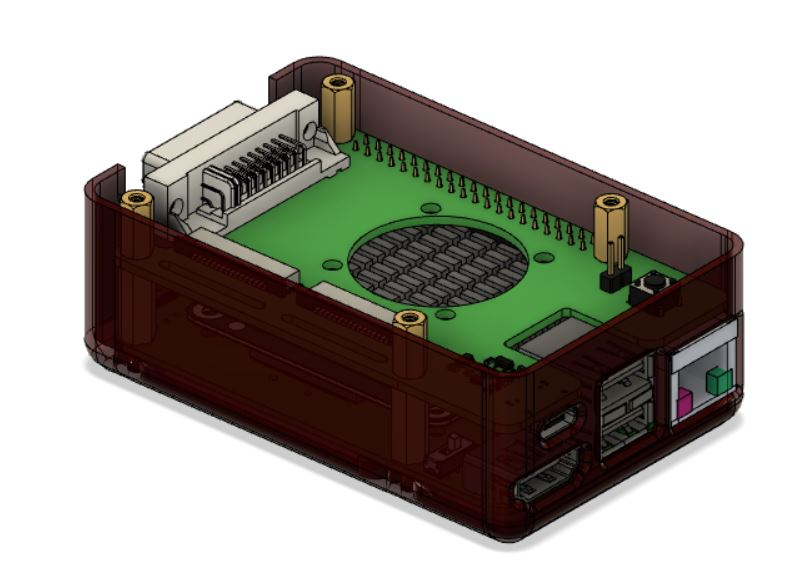

Mechanical CAD/ step files for stereoNinja.
early draft just for demonstration purposes. Probally still some finetuning todo 

Please Note that CAD files may use Models from third parties. Some of used Models: 
- Compute Module 4 STEP file aspberry Pi CM4 by Raspberry Pi Foundation
- Waveshare CM4-IO-BASE-B step file  	

License if own work:
CERN-OHL-W 

