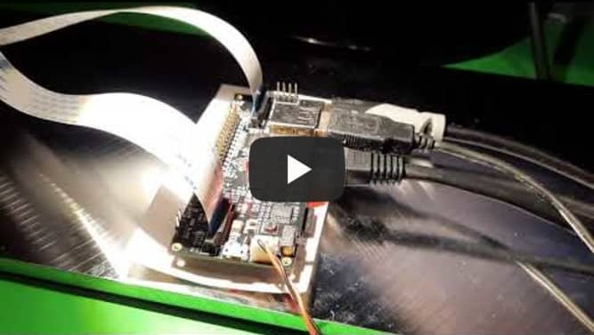

# Stereo Ninja

Stereo Ninja is a DIY digital stereo microscope

# Overview

If you ever soldered SMT components or looked for issues on one of those tiny PCBs, you know that using a good microscope helps a lot, especially if it is a stereo microscope. But a good stereo microscope comes with a hefty price tag, so it's not for everyone. A cheap alternative is using a "usb microscope", but then of course you do not have stereo vision.

Our idea is to combine best of both worlds. Having proper stereoscopic view on your work piece and using relatively cheap digital components for archiving that. If you already have a 3D capable monitor, you only need a pair of cameras with suitable optics and some electronics for combining the two video streams into a single one that your monitor understands. We are using a Raspberry Pi for that (what else? ;-)).

# Details

Stereo Ninja is a dual camera setup for stereoscopic microscopy. The heart of the project is a Raspberry Pi. To be precise, you need a Raspberry Pi 3 or 4 Compute Module and a breakout board that gives you access to both MIPI CSI camera input ports the chip set offers, but is not available at the standard Raspberry Pi 3 or 4 versions. Then of course, you need 2 RaspberryPi-compatible cameras with suitable lenses. Our microscope setup is meant for electronics work, so we chose lenses that do not give you that much of a magnification, but permits an adequate lens-object distance for conveniently working under it. Then of course, you need a 3D monitor for displaying the stereoscopic view on your workpiece. We chose a fast 3D-capable gaming monitor with shutter goggles. Finally, a nice stand for you camera is needed.

All these components allow a selection from a variety of choices. We'll try to come up with a good recommendation on what you would want to get, but it is also possible to mix and match these parts (makes sense e.g. when you already own e.g. a 3d monitor). We'll try to list many of these combinations and document how to get them working. If you try a new lens/camera/board/monitor, let us know how it worked for you!

Here's Uli giving you a quick demo of the Stereo Ninja:

# Where do I get more information?

This repository is work in progress. More info about what we did so far can be found on [hackaday.io](https://hackaday.io/project/180044-stereo-ninja)

# Roadmap

## Beta release (target: summer 2022)

[x] Proof-of-Concept: StereoPi + Raspi3 Compute Module: real-time video stream to 3d monitor
[x] Selecting suitable lenses; done (but will look at more later)
[ ] Dual-camera mount; done, 3d printed version work in progress
[x] Tests with CM4 (Raspi4 Compute Module)
[ ] latency optimization: test different software setups, measure latency
[ ] Evaluate possibility the use of standard (non 3D) monitors by generating the signals for the shutter glasses ourselves
[ ] Final BOM (todo)
[ ] Assembly guide / setup instructions (todo)

## Future feature ideas

* Integrate lighting into camera mount (we use an IKEA JANSJÖ for now, which works nicely)
* Integrate polarization filter
* software: digital zoom
* software: enable streaming/recording
* smart zoom: zoom into region where your solder tip or test lead points to
* enable video overlay (display PCB info like BOM directly on screen)
* Kicad integration 
* AR mode (e.g. for part placement on PCBs, highlighting tracks, etc)