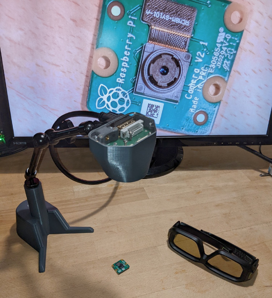

# Stereo Ninja

Stereo Ninja is a DIY digital stereo microscope

# Overview

If you ever soldered SMT components or looked for issues on one of those tiny PCBs, you know that using a good microscope helps a lot, especially if it is a stereo microscope. But a good stereo microscope comes with a hefty price tag, so it's not for everyone. A cheap alternative is using a "usb microscope", but then of course you do not have stereo vision.

Our idea is to combine best of both worlds. Having proper stereoscopic view on your work piece and using relatively cheap digital components for archiving that. If you already have a 3D capable monitor, you only need a pair of cameras with suitable optics and some electronics for combining the two video streams into a single one that your monitor understands. We are using a Raspberry Pi for that (what else? ;-)).

# Details

Stereo Ninja is a dual camera setup for stereoscopic microscopy. The heart of the project is a Raspberry Pi. To be precise, you need a Raspberry Pi 3 or 4 Compute Module and a breakout board that gives you access to both MIPI CSI camera input ports the chip set offers, but is not available at the standard Raspberry Pi 3 or 4 versions. Then of course, you need 2 RaspberryPi-compatible cameras with suitable lenses. Our microscope setup is meant for electronics work, so we chose lenses that do not give you that much of a magnification, but permits an adequate lens-object distance for conveniently working under it. Then of course, you need a 3D monitor for displaying the stereoscopic view on your workpiece. We chose a fast 3D-capable gaming monitor with shutter goggles. Finally, a nice stand for you camera is needed.

All these components allow a selection from a variety of choices. We'll try to come up with a good recommendation on what you would want to get, but it is also possible to mix and match these parts (makes sense e.g. when you already own e.g. a 3d monitor). We'll try to list many of these combinations and document how to get them working. If you try a new lens/camera/board/monitor, let us know how it worked for you!

Here's Uli giving you a quick demo of the Stereo Ninja:

# Where do I get more information?

This repository is work in progress. More info about what we did so far can be found on [hackaday.io](https://hackaday.io/project/180044-stereo-ninja)

# Roadmap

## Beta release (work in progress)

### Goals

* Hardware: 
  * Raspberry Pi CM4, Waveshare CM IO Board
  * 2x Raspberry Pi v1 camera + custom lens
  * integrate LED lighting
  * connection of camera module with Pi with single cable 
  * add 3 push buttons on camera module
* Software
  * Special version of raspivid
  * Outputs side-by-side stereo mode video to be used with 3d monitor
  * User can switch view (digital zoom on/off)
* Documentation
  * BOM
  * Assembly guide

### Todos

- [x] Proof-of-Concept: StereoPi + Raspi3 Compute Module: real-time video stream to 3d monitor
- [x] Tests with CM4 (Raspi4 Compute Module)
- [ ] Select suitable lenses, document this
- [x] Camera module: Dual-camera mount and enclosure (3d printed)
- [x] Camera module: print + test
- [x] Choose cable type for camera module to Pi connection
- [x] Camera board: circuit design 
- [x] Camera board: PCB layout
- [x] Camera board: assembly + testing
- [ ] Camera module: design LED PCB
- [ ] Camera module: LED PCB assembly and test
- [ ] Camera board: add microcrontoller
- [ ] Firmware for camera module microcontroller (send key presses over UART)
- [ ] Software: switching between mode 5 (full sensor) and mode 1 (digital zoom)
- [ ] Software: Communicate with camera module, allow switching of digital zoom
- [ ] latency optimization: test different software setups, measure latency
- [ ] Finalize Bill of Material
- [ ] Assembly guide / setup instructions

## Future feature ideas

* Evaluate possibility the use of standard (non 3D) monitors by generating the signals for the shutter glasses ourselves
* Integrate polarization filter
* software: enable highres photo snapshots
* software: enable streaming/recording
* try to use Raspi v2 compatible cameras (3rd party IMX219 cam with M12 lens mount), see [issue #1](https://github.com/StereoNinja/StereoNinja/issues/1)
* try to use Raspi HQ compatible cameras (3rd party IMX477 cam with M12 lens mount), see [issue #2](https://github.com/StereoNinja/StereoNinja/issues/2)
* smart zoom: zoom into region where your solder tip or test lead points to
* enable video overlay (display PCB info like BOM directly on screen)
* Kicad integration 
* AR mode (e.g. for part placement on PCBs, highlighting tracks, etc)

# FAQ

### I want to build one! Where is the BOM etc?

Hang on for a bit longer. We are preparing the first release for summer 2021. We will have a BOM and all the design files you need by then.

### Do I need a 3D monitor?

Yes. At least for the first version. We are planning a side project that would allow using standard monitors by driving shutter glasses with our own control electronics. But no work has been done on this yet.

### How can I contribute?

At the moment the development is done by a team located at the FabLab München. We are currently not prepared for onboarding 
people who cannot join our in-person meetings. But there are some topics where development could be done quite independently, 
e.g. support for standard monitors (see previous FAQ) or software support for the new Raspberry Pi camera infrastructure.
In any case, if you interested in joining efforts, get in touch!

### How can I get in touch with you?

Drop us an email: stereoninja@fablab-muenchen.de

We are also on twitter: https://twitter.com/_stereoninja

---

Stereo Ninja is a project by FabLab München e.V. It is part of the [MakerTools project](https://wiki.fablab-muenchen.de/pages/viewpage.action?pageId=126815075), which is sponsored by the Federal Ministry of Education and Research.
